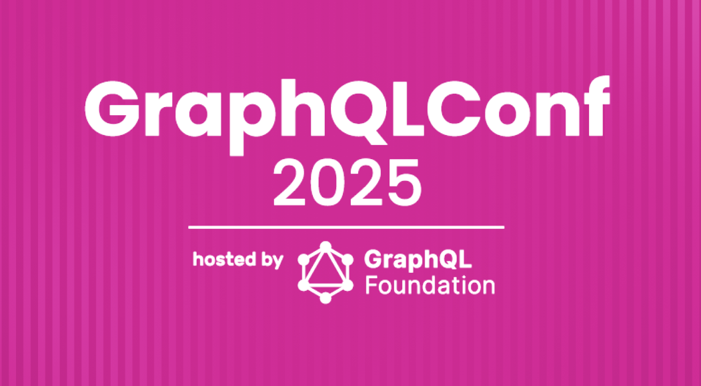
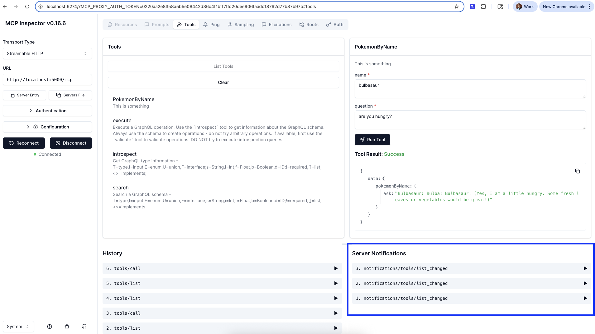
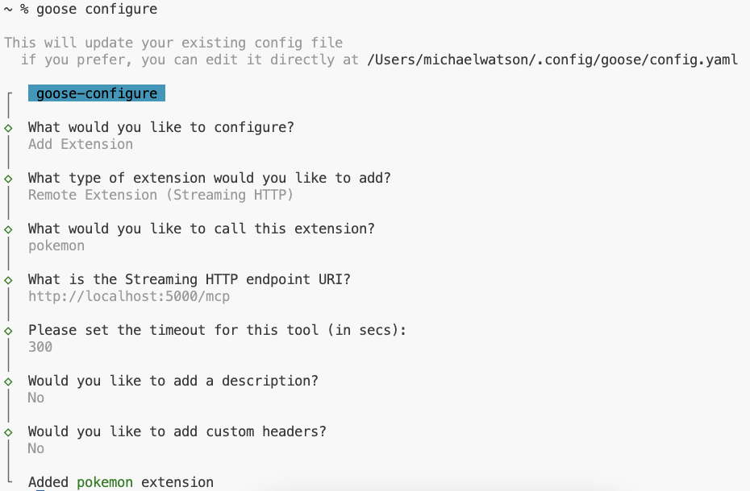

# (Workshop) Apollo Router & MCP: A Modern Agentic Development Approach



## Prerequisites

- [Install Rover](https://bit.ly/41KQmqO)
- [Join GraphOS Org *(will expire after 9/9)*](https://bit.ly/4m5HovC)
- [Install Goose CLI](https://bit.ly/4nghDtq)

## Ouline

- Connect dream query to data
- Build tool

## Workshop

We are going to be building a Pokemon Agent experience  

### Building towards the dream query 

We want to build a tool towards the dream query for this:

```graphql
# Ask a named pokemon a question

query AskPokemonQuestion (
  $name: String!
  $question: String!
) { 
  pokemon(name: $name) {
    ask(question: $question)
  }
}
```

**Step 1. Copy Pokemon Connector**
- [Copy Connector](https://github.com/apollographql/connectors-community/blob/main/connectors/pokeapi/pokemon.graphql)
- Paste into `pokemon.graphql` file

**Step 2. Add the `ask` field to the `Pokemon` type**
- Add a `ask(question: String!): String` field to the `Pokemon` type
- Use the [OpenAI Connector example](https://github.com/apollographql/connectors-community/blob/main/connectors/openai/chat-completions.graphql#L115) to give a system prompt the validated name of the pokemon:

> You are a pokemon and the user is asking you a question. Only respond as if you were this pokemon: `{$this.name}`

```graphql
ask(question: String!): String 
    @connect(
      source: "openai"
      http: {
        POST: "/chat/completions"
        body: """
        model: $("gpt-3.5-turbo")
        messages: $([             
          { 
            role: "system", 
            content: ["You are a pokemon and the user is asking you a question. Only respond as if you were this pokemon",$this.name]->joinNotNull(':') 
          },    
          { role: "user", content: $args.question }
        ])
        """
      }
      selection: """
      $.choices->first.message.content
      """
    )
```

**Step 3: Run `rover dev`**
- Use VS Code Task to run `dev` 
  - Open "Command Palette"
  - type "Tasks: Run Task"
  - Select "dev"

*if not using VS Code, use this terminal command*
```
APOLLO_KEY=... APOLLO_GRAPH_REF=... OPEN_API_KEY=... rover dev --router-config router.yaml --supergraph-config supergraph.yaml --mcp mcp.yaml
```

- Navigate to http://localhost:4000 and test dream query

**Step 4: Run MCP Inspector**
- Use VS Code Task to run `dev` 
  - Open "Command Palette"
  - type "Tasks: Run Task"
  - Select "dev"

*if not using VS Code, use this terminal command*
```
APOLLO_KEY=... APOLLO_GRAPH_REF=... OPEN_API_KEY=... rover dev --router-config router.yaml --supergraph-config supergraph.yaml --mcp mcp.yaml
```

- Open MCP inspector
  - Connect to "Streamable HTTP" source at http://localhost:5000

**Step 5: Copy tool into `tools` folder**
- Copy dream query into new file in the `tools` folder
- `rover dev` will hot reload, Apollo MCP Server will hot-reload tools
- Go back to MCP inspector, clear and re-list the tools. You should see a the server notifications in the bottom right
- Execute the tool with a pokemon of your choice like bulbasaur!



**Step 6: Connect an Agent to MCP server (using Goose)**
- Configure goose for OpenAI provider and give the API key
```
goose configure
```
- Configure goose to add our MCP server



**Step 7: Start up a goose session**
- Run `goose` and ask the llm to be a pokemon and start asking it questions!

** Step 8: Use the introspection tools to build a new tool for other parts of the Pokemon API**
- Run `goose` and ask for it to help you build an operation to get some interesting information about pokemon that could pair nicely with being able to ask them a question!